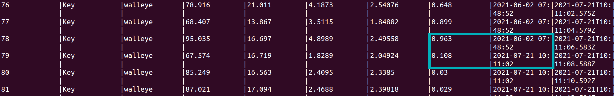
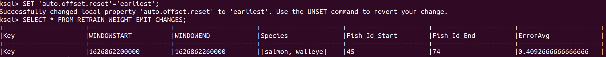

# Kafka-R: Real-time Prediction

[![LinkedIn][linkedin-shield]][linkedin-url]

This tutorial explains how a machine learning model is applied on real-time data.
It predicts incoming data as well as the model is retrained when the prediction results decrease.
It focuses on simplicity and can be seen as a baseline for similar projects.
You can read more about it in my blog article:
[Apache Kafka and R: Real-Time Prediction and Model (Re)training](https://www.confluent.io/blog/how-baader-built-a-predictive-analytics-machine-learning-system-with-kafka-and-rstudio/).


## Prerequisites

* [docker](https://docs.docker.com/get-docker/)
* [docker-compose](https://docs.docker.com/compose/install/)

## Data Flow


### Kafka Producer
Let's go over the single parts of the data flow. A Kafka Producer produces simulated data of a fish's size measurement
as well as the weight continuously into two Kafka topics: `machine-weight` and `machine-measurement`.

### Kafka Streams
A Kafka Streams application consumes the `machine-measurement` topic and communicates via REST API with R
to predict the weight using linear regression. You can find a unit test for the
topology as well as an integration test for the REST communication [here](KafkaStreams/src/test/kotlin).

### ksqlDB
In ksqlDB both streams are joined, and the prediction is compared with the actual weight (error).

### Kafka Connect
One connector stores data in MongoDB so that it can be used for retraining the regression. 
The other connector acts as a trigger to do the retraining once the error exceeds a threshold.

### RStudio
In R the model itself, the prediction function, and the retraining function are stored and accessible via REST API.
You can find a test [here](R/test).


## Run
```
docker-compose up -d
```

It starts:
* Zookeeper
* Kafka Broker
* Kafka Topics
    * creates initial topics
* Kafka Connect
    * with [MongoDB Source and Sink Connector](https://www.confluent.io/hub/mongodb/kafka-connect-mongodb)
    * with [HTTP Sink Connector](https://www.confluent.io/hub/confluentinc/kafka-connect-http)
* ksqlDB Server
* ksqlDB Client 
* MongoDB  
* Kafka Producer
    * built docker image executing fat JAR
* Kafka Streams
    * built docker image executing fat JAR
* RStudio
    * built docker image with RStudio with [plumber](https://cran.r-project.org/web/packages/plumber/plumber.pdf), [dplyr](https://cran.r-project.org/web/packages/dplyr/dplyr.pdf), and [mongolite](https://cran.r-project.org/web/packages/mongolite/mongolite.pdf) installed and entrypoint

Make sure to wait some time until everything is fully started up.

### Start Connectors
First, we start the two Kafka Connectors:
```
curl -X POST -H "Content-Type: application/json" --data @MongoDBConnector.json http://localhost:8083/connectors | jq
curl -X POST -H "Content-Type: application/json" --data @HTTPConnector.json http://localhost:8083/connectors | jq
```

### Set up ksqlDB Queries
Use the client to access ksqlDB:
```
docker exec -it ksqldb-cli ksql http://ksqldb-server:8088
```
Run all queries stored in [Queries.ksql](KsqlDB/Queries.ksql).

### Inspect Data Pipeline
To gain insights of the pipeline, we look at the Stream `DIFF_WEIGHT`:
```
SELECT * FROM DIFF_WEIGHT EMIT CHANGES;
```


We can also detect when the retrained model is applied because the prediction error
decreases, and the model time changes.




In the KTable `RETRAIN_WEIGHT`, we see the events that trigger the retraining.
```
SET 'auto.offset.reset'='earliest';
SELECT * FROM RETRAIN_WEIGHT EMIT CHANGES;
```




[linkedin-shield]: https://img.shields.io/badge/-LinkedIn-black.svg?style=flat-square&logo=linkedin&colorB=555
[linkedin-url]: https://www.linkedin.com/in/patrick-neff-7bb3b21a4/
