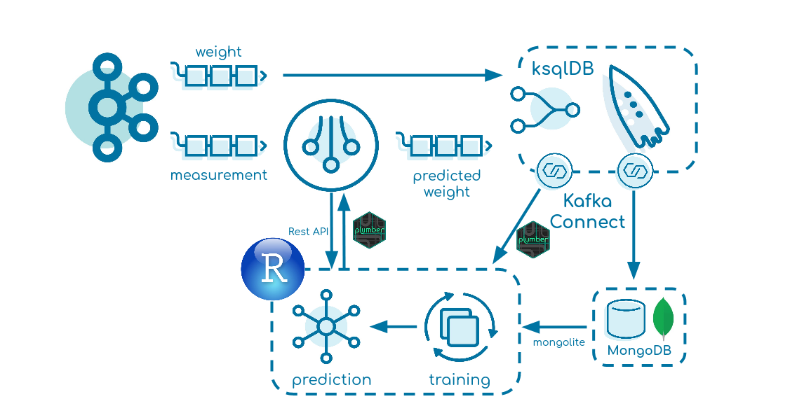

# Kafka-R: Realtime Prediction

[![LinkedIn][linkedin-shield]][linkedin-url]

This tutorial explains how a machine learning model is used on real-time data.

[linkedin-shield]: https://img.shields.io/badge/-LinkedIn-black.svg?style=flat-square&logo=linkedin&colorB=555
[linkedin-url]: https://www.linkedin.com/in/patrick-neff-7bb3b21a4/